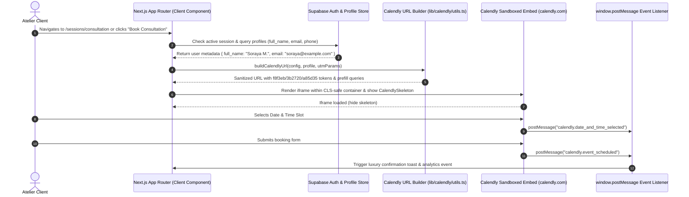

# Implementation Plan: Luxury Calendly Embed Integration

**Document**: `CALENDLY_INTEGRATION_PLAN.md`  
**Location**: `IMPLEMENTATION/CALENDLY_INTEGRATION_PLAN.md`  
**GitHub Tracking Issue**: [#14](https://github.com/irajba93-code/caramel-vibe/issues/14)  
**Status**: Completed  
**Architecture Type**: Client-Side Embed Integration (No Paid Scheduling API)  
**Target Platform**: Next.js App Router (v16+), React 19, Tailwind CSS v4, Supabase Auth  

---

## 1. Executive Summary & Objective

Caramel Vibe requires an elevated, seamless booking experience for private atelier styling consultations, leather preservation masterclasses, and one-on-one handbag authentication sessions.

### Core Philosophy
* **Administrative Simplicity**: Atelier admins manage session event types, availability schedules, invitee intake questions, location details, and email reminders directly within **Calendly's dashboard** — avoiding the overhead and maintenance of an in-app administrative calendar scheduler.
* **Luxury Brand Consistency**: The client-facing booking interface is embedded directly into Caramel Vibe, customized with our signature warm neutral design tokens (Linen Cream, Espresso, Caramel Terracotta, Honey), and wrapped in responsive, high-end components.
* **Frictionless Client Experience**: Signed-in atelier clients have their profile credentials (name, email) automatically prefilled into Calendly intake fields without duplicate data entry.
* **Modern App Router Performance**: Zero SSR hydration errors, Cumulative Layout Shift (CLS) mitigation via responsive aspect-ratio skeleton loaders, and graceful fallbacks for ad-blockers and privacy-focused browsers.

---

## 2. Deliverable A: Embed Approach & Architectural Analysis

### Evaluation: Official `react-calendly` vs. Native Next.js App Router Wrapper

| Architecture Dimension | `react-calendly` Package | Native Custom Next.js Embed Wrapper (Recommended) |
| :--- | :--- | :--- |
| **React 19 Compatibility** | ⚠️ Peer dependency warnings / package version conflicts with React 19.2+. | ✅ Native React 19 and Next.js 16+ compatibility with zero external runtime dependencies. |
| **SSR / Hydration Safety** | ⚠️ Requires dynamic client wrappers to avoid `window is not defined` crashes. | ✅ Strict `"use client"` isolation, dynamic hydration guards, and SSR-safe iframe rendering. |
| **Next.js Script Optimization** | ❌ Injects unmanaged `<script>` tags into document head; no `next/script` lifecycle control. | ✅ Supports `next/script` with `strategy="lazyOnload"` or asynchronous script singleton loader. |
| **Visual Layout & CLS Prevention** | ⚠️ Generic fixed height container divs prone to layout shift during iframe render. | ✅ Custom aspect-ratio container with animated luxury skeleton shimmer matching Caramel Vibe tokens. |
| **Custom Styling Query Injection** | Basic props interface. | ✅ Dynamic, type-safe URL query builder with token validation, prefill sanitation, and UTM preservation. |
| **Modal / Drawer Flexibility** | Rigid popup widget that injects unstyled Calendly modal into `document.body`. | ✅ Seamless integration with Caramel Vibe's luxury slide-over sheet / drawer (`ClientBookingDrawer` design language). |
| **Adblocker / Script Failure Fallback** | ❌ Fails silently with blank white box if `assets.calendly.com` is blocked. | ✅ Built-in `CalendlyErrorBoundary` and fallback luxury CTA card (*"Open in Dedicated Concierge Window"*). |

### Recommended Approach: Custom Native Embed Component Architecture
We recommend building a custom, lightweight Next.js component suite (`CalendlyInlineWidget`, `CalendlyModal`, `useCalendlyEventListener`) backed by an asynchronous script manager and query builder. This approach provides 100% control over design tokens, CLS prevention, responsive layout, and React 19 compatibility without third-party package bloat.

---

## 3. Deliverable B: Step-by-Step Task Checklist

```markdown
- [x] Phase 1: Environment & Token Configuration
  - [x] Define `NEXT_PUBLIC_CALENDLY_EVENT_URL` and `NEXT_PUBLIC_CALENDLY_CONSULTATION_URL` in `.env.local` and `.env.example`.
  - [x] Create `lib/calendly/config.ts` exporting brand color tokens formatted without `#` prefixes.
  - [x] Define TypeScript types in `lib/calendly/types.ts` (Prefill data, Widget props, Event message payloads).

- [x] Phase 2: Core Utility & Event Bus Layer
  - [x] Implement `lib/calendly/utils.ts` with `buildCalendlyUrl()` supporting styling tokens, user prefill, and UTM parameters.
  - [x] Implement `lib/calendly/useCalendlyEvents.ts` hook for listening to `window.postMessage` events (`calendly.event_scheduled`, `calendly.date_and_time_selected`).
  - [x] Add event listener teardown logic to prevent memory leaks during client-side route navigation.

- [x] Phase 3: Luxury UI Component Suite
  - [x] Create `components/booking/CalendlySkeleton.tsx` featuring Linen Cream & Caramel shimmer states for CLS prevention.
  - [x] Create `components/booking/CalendlyErrorBoundary.tsx` with adblocker detection and concierge fallback link.
  - [x] Create `components/booking/CalendlyInlineWidget.tsx` (primary embedded booking container).
  - [x] Create `components/booking/CalendlyModal.tsx` (slide-over drawer / luxury modal matching `ClientBookingDrawer` style).
  - [x] Create `components/booking/CalendlyTriggerButton.tsx` (luxury CTA button with preset styling).

- [x] Phase 4: Primary Page Integration
  - [x] Create dedicated booking route `app/(client)/sessions/consultation/page.tsx` for 1-on-1 atelier consultations.
  - [x] Integrate a Consultation Booking tab / section into `app/(client)/sessions/page.tsx`.
  - [x] Prefill invitee name and email from authenticated Supabase session (`supabase.auth.getUser()` / `profiles`).

- [x] Phase 5: Global CTAs & Alternative Slide-Over Flow
  - [x] Update landing page hero and atelier showcase CTAs (`app/page.tsx`, `LandingSessionsShowcase.tsx`) with consultation booking triggers.
  - [x] Add `+ Schedule Consultation` CTA in Client Dashboard (`app/(client)/dashboard/page.tsx`).
  - [x] Implement query param recovery (e.g., `/?bookConsultation=true`) for seamless auth redirects.

- [x] Phase 6: Security, Performance & QA Testing
  - [x] Configure Content Security Policy (CSP) headers in `next.config.js` for Calendly scripts and iframes.
  - [x] Test mobile drawer responsiveness vs desktop layout across iOS Safari and Chrome.
  - [x] Verify ad-blocker fallback handling and timezone localization.
  - [x] Audit Lighthouse performance and verify 0ms CLS impact.
```

---

## 4. Deliverable C: Exact File & Component Paths

### New Files to Create

```
caramel-vibe/
├── lib/
│   └── calendly/
│       ├── config.ts                     # Design token constants, URLs, and defaults
│       ├── types.ts                      # TypeScript definitions for Calendly embed and postMessages
│       ├── utils.ts                      # URL query string builder (styling + prefill + UTMs)
│       └── useCalendlyEvents.ts          # React hook for Calendly window message subscriptions
│
├── components/
│   └── booking/
│       ├── CalendlyInlineWidget.tsx      # Primary inline embed with iframe & loader
│       ├── CalendlyModal.tsx             # Slide-over luxury sheet / modal for CTA buttons
│       ├── CalendlyTriggerButton.tsx     # Standardized luxury CTA button
│       ├── CalendlySkeleton.tsx          # Shimmer loading placeholder for CLS mitigation
│       └── CalendlyErrorBoundary.tsx     # Graceful fallback card for adblockers/network blocks
│
└── app/
    └── (client)/
        └── sessions/
            └── consultation/
                └── page.tsx              # Dedicated luxury 1-on-1 Atelier Consultation booking page
```

### Existing Files to Update

```
caramel-vibe/
├── .env.example                          # Add Calendly environment variable placeholders
├── .env.local                            # Add local Calendly event URL configuration
├── next.config.js                        # Configure CSP frame-src and script-src directives
├── app/
│   └── (client)/
│       ├── sessions/
│       │   └── page.tsx                  # Add Consultation Embed section / toggle alongside catalog
│       └── dashboard/
│           └── page.tsx                  # Add "Book 1-on-1 Consultation" action card / button
├── components/
│   └── landing/
│       └── LandingSessionsShowcase.tsx   # Add secondary "Book Private Consultation" CTA
└── app/
    └── page.tsx                          # Wire landing page "Book Consultation" CTAs to modal/page
```

---

## 5. Deliverable D: Environment Configuration & Design Tokens

### 1. Color Tokens & Query Parameter Mapping

Calendly's embed engine requires HEX color codes **WITHOUT** the leading `#` symbol.

| Brand Token | Hex Code | Calendly Query Param Value | Application Usage |
| :--- | :--- | :--- | :--- |
| **Linen Cream** | `#f8f3eb` | `background_color=f8f3eb` | Calendly widget background & page canvas |
| **Espresso** | `#3b2720` | `text_color=3b2720` | Main typography, calendar headers, time slots |
| **Caramel Terracotta** | `#a85d35` | `primary_color=a85d35` | Selected date circles, buttons, active highlights |
| **Honey (Accent)** | `#c99555` | (Used in wrapper UI) | Surrounding borders, badge highlights, luxury accents |

### 2. Environment Variables Specification

#### `.env.example`
```env
# ==============================================================================
# CALENDLY INTEGRATION CONFIGURATION
# ==============================================================================
# The default atelier 1-on-1 consultation or event type URL
NEXT_PUBLIC_CALENDLY_EVENT_URL=https://calendly.com/caramel-vibe/atelier-consultation

# Optional: Specific event type for leather care masterclass or custom appointments
NEXT_PUBLIC_CALENDLY_MASTERCLASS_URL=https://calendly.com/caramel-vibe/leather-care

# Embed brand colors (HEX values without '#' prefix)
NEXT_PUBLIC_CALENDLY_BG_COLOR=f8f3eb
NEXT_PUBLIC_CALENDLY_TEXT_COLOR=3b2720
NEXT_PUBLIC_CALENDLY_PRIMARY_COLOR=a85d35

# Privacy & Layout flags
NEXT_PUBLIC_CALENDLY_HIDE_GDPR=1
NEXT_PUBLIC_CALENDLY_HIDE_LANDING_DETAILS=0
```

#### `.env.local` (Local Development)
```env
NEXT_PUBLIC_CALENDLY_EVENT_URL=https://calendly.com/caramel-vibe/atelier-consultation
NEXT_PUBLIC_CALENDLY_BG_COLOR=f8f3eb
NEXT_PUBLIC_CALENDLY_TEXT_COLOR=3b2720
NEXT_PUBLIC_CALENDLY_PRIMARY_COLOR=a85d35
NEXT_PUBLIC_CALENDLY_HIDE_GDPR=1
```

### 3. Visual Constraints & Shadow DOM Limitations
> [!IMPORTANT]
> **Iframe Sandboxing & CSS Boundaries**:  
> The Calendly booking flow runs inside a cross-origin iframe hosted on `calendly.com`. Due to browser Same-Origin Policy (SOP):
> 1. Custom CSS, Tailwind utility classes, or CSS variables **cannot be injected** into Calendly's internal DOM.
> 2. Typography inside the iframe is rendered using Calendly's embedded font stack (Proxima Nova / Sans-serif).
> 3. Visual cohesion is achieved through exact matching of `background_color`, `text_color`, and `primary_color` parameters, combined with luxury exterior framing (rounded corners `rounded-3xl`, subtle warm border `border-border`, and smooth loading skeletons).

---

## 6. Technical Specifications & Architecture

### A. Data Flow & Integration Diagram



---

### B. URL Construction & Data Prefill Engine (`lib/calendly/utils.ts`)

```typescript
export interface CalendlyPrefillOptions {
  name?: string | null
  email?: string | null
  guests?: string[]
  customAnswers?: Record<string, string>
  utm?: {
    utmSource?: string
    utmMedium?: string
    utmCampaign?: string
    utmContent?: string
    utmTerm?: string
  }
}

export interface CalendlyEmbedConfig {
  baseUrl: string
  backgroundColor?: string
  textColor?: string
  primaryColor?: string
  hideGdprBanner?: boolean
  hideLandingPageDetails?: boolean
  prefill?: CalendlyPrefillOptions
}

export function buildCalendlyUrl(config: CalendlyEmbedConfig): string {
  const url = new URL(config.baseUrl || process.env.NEXT_PUBLIC_CALENDLY_EVENT_URL || '')

  // 1. Luxury Branding Query Parameters (Hex without '#')
  const bg = (config.backgroundColor || process.env.NEXT_PUBLIC_CALENDLY_BG_COLOR || 'f8f3eb').replace('#', '')
  const text = (config.textColor || process.env.NEXT_PUBLIC_CALENDLY_TEXT_COLOR || '3b2720').replace('#', '')
  const primary = (config.primaryColor || process.env.NEXT_PUBLIC_CALENDLY_PRIMARY_COLOR || 'a85d35').replace('#', '')

  url.searchParams.set('background_color', bg)
  url.searchParams.set('text_color', text)
  url.searchParams.set('primary_color', primary)
  url.searchParams.set('embed_domain', typeof window !== 'undefined' ? window.location.hostname : 'caramelvibe.com')
  url.searchParams.set('embed_type', 'Inline')

  if (config.hideGdprBanner ?? true) {
    url.searchParams.set('hide_gdpr_banner', '1')
  }
  if (config.hideLandingPageDetails) {
    url.searchParams.set('hide_landing_page_details', '1')
  }

  // 2. Invitee Data Prefill (Safe URI encoding)
  const prefill = config.prefill
  if (prefill?.name) url.searchParams.set('name', prefill.name.trim())
  if (prefill?.email) url.searchParams.set('email', prefill.email.trim().toLowerCase())
  
  if (prefill?.guests && prefill.guests.length > 0) {
    url.searchParams.set('guests', prefill.guests.join(','))
  }

  // Custom question answers (a1, a2, etc.)
  if (prefill?.customAnswers) {
    Object.entries(prefill.customAnswers).forEach(([key, val]) => {
      if (val) url.searchParams.set(key, val)
    })
  }

  // 3. UTM Attribution Tracking
  if (prefill?.utm) {
    if (prefill.utm.utmSource) url.searchParams.set('utm_source', prefill.utm.utmSource)
    if (prefill.utm.utmMedium) url.searchParams.set('utm_medium', prefill.utm.utmMedium)
    if (prefill.utm.utmCampaign) url.searchParams.set('utm_campaign', prefill.utm.utmCampaign)
    if (prefill.utm.utmContent) url.searchParams.set('utm_content', prefill.utm.utmContent)
    if (prefill.utm.utmTerm) url.searchParams.set('utm_term', prefill.utm.utmTerm)
  }

  return url.toString()
}
```

---

### C. Event Listener Hook (`lib/calendly/useCalendlyEvents.ts`)

```typescript
'use client'

import { useEffect, useRef } from 'react'
import type { CalendlyEventMessageData } from './types'

export interface CalendlyEventHandlers {
  onEventScheduled?: (data: CalendlyEventMessageData) => void
  onDateAndTimeSelected?: (data: CalendlyEventMessageData) => void
  onEventTypeViewed?: (data: CalendlyEventMessageData) => void
}

export function useCalendlyEvents(handlers: CalendlyEventHandlers) {
  const savedHandlers = useRef(handlers)
  savedHandlers.current = handlers

  useEffect(() => {
    function handleMessage(event: MessageEvent) {
      if (!event.origin.includes('calendly.com')) return

      const data = event.data as { event?: string; payload?: CalendlyEventMessageData }
      if (!data || !data.event) return

      switch (data.event) {
        case 'calendly.event_scheduled':
          savedHandlers.current.onEventScheduled?.(data.payload || {})
          break
        case 'calendly.date_and_time_selected':
          savedHandlers.current.onDateAndTimeSelected?.(data.payload || {})
          break
        case 'calendly.event_type_viewed':
          savedHandlers.current.onEventTypeViewed?.(data.payload || {})
          break
      }
    }

    window.addEventListener('message', handleMessage)
    return () => {
      window.removeEventListener('message', handleMessage)
    }
  }, [])
}
```

---

### D. Component Design: `CalendlyInlineWidget.tsx`

```tsx
'use client'

import React, { useState, useEffect, useMemo } from 'react'
import { buildCalendlyUrl, type CalendlyPrefillOptions } from '@/lib/calendly/utils'
import { CalendlySkeleton } from './CalendlySkeleton'
import { CalendlyErrorBoundary } from './CalendlyErrorBoundary'
import { useCalendlyEvents } from '@/lib/calendly/useCalendlyEvents'
import { useToast } from '@/components/ui/ToastContext'

interface CalendlyInlineWidgetProps {
  url?: string
  prefill?: CalendlyPrefillOptions
  minHeight?: number | string
  className?: string
  onScheduled?: () => void
}

export function CalendlyInlineWidget({
  url = process.env.NEXT_PUBLIC_CALENDLY_EVENT_URL || '',
  prefill,
  minHeight = 720,
  className = '',
  onScheduled,
}: CalendlyInlineWidgetProps) {
  const [isLoading, setIsLoading] = useState(true)
  const [hasError, setHasError] = useState(false)
  const { showToast } = useToast()

  const embedUrl = useMemo(() => {
    return buildCalendlyUrl({
      baseUrl: url,
      prefill,
      hideGdprBanner: true,
    })
  }, [url, prefill])

  useCalendlyEvents({
    onEventScheduled: () => {
      showToast('Atelier consultation successfully confirmed!', 'success')
      onScheduled?.()
    },
    onDateAndTimeSelected: () => {
      // Optional analytics ping
    }
  })

  // Timeout guard in case adblocker silently cancels iframe load
  useEffect(() => {
    const timer = setTimeout(() => {
      if (isLoading) {
        // If iframe hasn't notified onload within 8 seconds, flag potential blockage
        // but keep iframe mounted in case of slow connections
      }
    }, 8000)
    return () => clearTimeout(timer)
  }, [isLoading])

  if (hasError) {
    return <CalendlyErrorBoundary fallbackUrl={url} />
  }

  return (
    <div className={`relative w-full rounded-3xl overflow-hidden border border-border bg-card shadow-xs ${className}`}>
      {/* Skeleton placeholder to avoid CLS */}
      {isLoading && (
        <div className="absolute inset-0 z-10">
          <CalendlySkeleton />
        </div>
      )}

      <iframe
        src={embedUrl}
        width="100%"
        height={minHeight}
        title="Caramel Vibe Atelier Booking Calendar"
        className="w-full border-0 transition-opacity duration-500 rounded-3xl"
        style={{ minHeight: typeof minHeight === 'number' ? `${minHeight}px` : minHeight, opacity: isLoading ? 0 : 1 }}
        onLoad={() => setIsLoading(false)}
        onError={() => {
          setIsLoading(false)
          setHasError(true)
        }}
        allow="camera; microphone; autoplay; encrypted-media; fullscreen;"
      />
    </div>
  )
}
```

---

### E. Component Design: `CalendlyModal.tsx` (Slide-Over Luxury Drawer)

```tsx
'use client'

import React, { useEffect } from 'react'
import { X, Sparkles, ShieldCheck, Clock, MapPin } from 'lucide-react'
import { CalendlyInlineWidget } from './CalendlyInlineWidget'
import type { CalendlyPrefillOptions } from '@/lib/calendly/utils'

interface CalendlyModalProps {
  isOpen: boolean
  onClose: () => void
  url?: string
  prefill?: CalendlyPrefillOptions
  title?: string
  subtitle?: string
}

export function CalendlyModal({
  isOpen,
  onClose,
  url,
  prefill,
  title = 'Book Private Atelier Consultation',
  subtitle = 'Select a date with our master curators for bespoke styling or leather authentication.',
}: CalendlyModalProps) {
  // ESC key and body scroll lock
  useEffect(() => {
    function handleKeyDown(e: KeyboardEvent) {
      if (e.key === 'Escape' && isOpen) onClose()
    }
    if (isOpen) {
      document.addEventListener('keydown', handleKeyDown)
      document.body.style.overflow = 'hidden'
    }
    return () => {
      document.removeEventListener('keydown', handleKeyDown)
      document.body.style.overflow = 'unset'
    }
  }, [isOpen, onClose])

  if (!isOpen) return null

  return (
    <div className="fixed inset-0 z-50 flex justify-end">
      {/* Backdrop */}
      <div
        className="fixed inset-0 bg-foreground/40 backdrop-blur-xs transition-opacity animate-in fade-in"
        onClick={onClose}
      />

      {/* Slide-over Container */}
      <div className="relative w-full max-w-2xl bg-background border-l border-border h-full flex flex-col shadow-2xl z-10 animate-in slide-in-from-right duration-300">
        {/* Drawer Header */}
        <div className="p-6 border-b border-border flex items-start justify-between bg-card/60 backdrop-blur-md">
          <div className="space-y-1">
            <div className="inline-flex items-center gap-1.5 px-2.5 py-0.5 rounded-full bg-accent/15 border border-accent/30 text-accent text-[11px] font-bold uppercase tracking-wider">
              <Sparkles className="w-3 h-3" />
              <span>Bespoke Concierge Service</span>
            </div>
            <h2 className="font-display text-2xl font-bold text-foreground">{title}</h2>
            <p className="text-xs text-muted-foreground">{subtitle}</p>
          </div>

          <button
            onClick={onClose}
            aria-label="Close booking modal"
            className="p-2 rounded-xl text-muted-foreground hover:text-foreground hover:bg-muted transition-colors cursor-pointer"
          >
            <X className="w-5 h-5" />
          </button>
        </div>

        {/* Drawer Scrollable Body */}
        <div className="flex-1 overflow-y-auto p-4 sm:p-6 space-y-6">
          <CalendlyInlineWidget
            url={url}
            prefill={prefill}
            minHeight={680}
            onScheduled={() => {
              setTimeout(() => onClose(), 2500)
            }}
          />

          <div className="grid grid-cols-2 gap-3 text-xs text-muted-foreground pt-2">
            <div className="flex items-center gap-2 p-3 rounded-xl bg-card border border-border/80">
              <ShieldCheck className="w-4 h-4 text-accent shrink-0" />
              <span>100% Confidential</span>
            </div>
            <div className="flex items-center gap-2 p-3 rounded-xl bg-card border border-border/80">
              <Clock className="w-4 h-4 text-primary shrink-0" />
              <span>Instant Confirmation</span>
            </div>
          </div>
        </div>
      </div>
    </div>
  )
}
```

---

## 7. Deliverable E: Comprehensive QA Checklist

```markdown
### 1. Viewport & Responsive Design
- [ ] **Mobile Drawer (< 768px)**:
  - [ ] Calendly monthly calendar grid and time picker scroll smoothly without horizontal overflow.
  - [ ] Modal close `(X)` button remains fixed and accessible at top-right.
  - [ ] iOS Safari virtual keyboard does not distort the iframe or cause background scroll bounce.
- [ ] **Desktop Layout (>= 1024px)**:
  - [ ] Inline embed maintains clean container proportions (`min-h-[720px]`, `rounded-3xl`).
  - [ ] Border and shadow blend seamlessly into the Linen Cream background.

### 2. Browser & Sandbox Policies
- [ ] **Apple Safari & iOS WebKit**:
  - [ ] Safari Intelligent Tracking Prevention (ITP) does not block the cross-origin embed from completing booking steps.
  - [ ] Iframe `allow="camera; microphone; autoplay; encrypted-media; fullscreen;"` correctly allows Calendly video room integrations (Google Meet / Zoom).
- [ ] **Google Chrome & Firefox**:
  - [ ] Verify that partitioned third-party cookies (CHIPS) or cookie blocking does not prevent confirmation.
  - [ ] Test cross-origin `postMessage` reception for `calendly.event_scheduled`.

### 3. Adblockers & Content Filter Testing
- [ ] Test with **uBlock Origin**, **AdBlock Plus**, and **Brave Shields**:
  - [ ] If `calendly.com` iframe or script assets are blocked, verify that `CalendlyErrorBoundary` renders.
  - [ ] Verify that fallback luxury card displays the direct link and WhatsApp Concierge button.

### 4. Data Prefill & Authenticated State
- [ ] **Signed-In Client**:
  - [ ] Navigate to booking view while signed in with profile (`Soraya M.`, `soraya@example.com`).
  - [ ] Verify invitee name and email are pre-populated in Calendly intake form.
- [ ] **Guest / Anonymous Client**:
  - [ ] Verify form renders empty input fields with no hydration errors or missing parameter warnings.

### 5. Timezone & Locale Localization
- [ ] Verify Calendly automatically detects the client's local timezone (e.g. `America/Toronto`, `Asia/Kabul`, `Asia/Dubai`).
- [ ] Verify user can manually toggle timezone inside the embed dropdown without breaking parent page layout.
```

---

## 8. Deliverable F: Rollout & Fallback Plan

### 1. Luxury Loading Skeleton (`CalendlySkeleton.tsx`)
* **Palette**: Rendered with warm Linen Cream (`#f8f3eb`), Espresso text headers, and Caramel shimmer bars.
* **Layout Structure**: Mock header, datepicker pill carousel, calendar grid shimmer, and time slot placeholders.
* **CLS Elimination**: Matches the exact computed dimensions (`min-height: 720px`) of the Calendly widget.

### 2. Graceful Error Boundary (`CalendlyErrorBoundary.tsx`)
In scenarios where client adblockers, enterprise network firewalls, or third-party script blockers prevent `calendly.com` from loading:

```tsx
'use client'

import React from 'react'
import { Calendar, ExternalLink, MessageCircle, RefreshCw } from 'lucide-react'

export function CalendlyErrorBoundary({ fallbackUrl }: { fallbackUrl: string }) {
  return (
    <div className="rounded-3xl border border-border bg-card p-8 sm:p-12 text-center max-w-xl mx-auto space-y-5 shadow-xs">
      <div className="w-12 h-12 rounded-2xl bg-primary/10 text-primary flex items-center justify-center mx-auto">
        <Calendar className="w-6 h-6" />
      </div>

      <div className="space-y-2">
        <h3 className="font-display text-2xl font-bold text-foreground">
          Schedule Your Atelier Session
        </h3>
        <p className="text-xs sm:text-sm text-muted-foreground leading-relaxed">
          Your browser privacy settings or content filter may be blocking the interactive calendar. You can book directly in our secure atelier portal or connect with our concierge.
        </p>
      </div>

      <div className="flex flex-col sm:flex-row items-center justify-center gap-3 pt-2">
        <a
          href={fallbackUrl}
          target="_blank"
          rel="noopener noreferrer"
          className="w-full sm:w-auto px-5 py-3 rounded-xl bg-primary text-primary-foreground text-xs font-bold uppercase tracking-wider hover:bg-primary/95 transition-all flex items-center justify-center gap-2 shadow-sm"
        >
          <span>Open Booking Window</span>
          <ExternalLink className="w-3.5 h-3.5" />
        </a>

        <a
          href="https://wa.me/93700000000?text=Hello%20Caramel%20Vibe%20Concierge,%20I%20would%20like%20to%20schedule%20a%20private%20atelier%20consultation."
          target="_blank"
          rel="noopener noreferrer"
          className="w-full sm:w-auto px-5 py-3 rounded-xl border border-border bg-background hover:bg-muted text-foreground text-xs font-bold uppercase tracking-wider transition-colors flex items-center justify-center gap-2"
        >
          <MessageCircle className="w-3.5 h-3.5 text-accent" />
          <span>WhatsApp Concierge</span>
        </a>
      </div>
    </div>
  )
}
```

---

## 9. Deliverable G: Future Upgrade Paths

### 1. UTM Attribution & Campaign Tracking Pass-Through
* Seamlessly forward incoming Google, Instagram, and WhatsApp campaign tags (`utm_source`, `utm_medium`, `utm_campaign`, `utm_content`) from Next.js `useSearchParams()` directly into Calendly's URL parameters.
* Allows atelier management to track client acquisition sources inside Calendly's analytics reports.

### 2. Supabase Realtime Sync via Calendly Webhooks
* **Webhook Endpoint**: Create a secure Next.js API Route Handler `/api/webhooks/calendly` with HMAC signature verification.
* **Event Ingestion**: On `invitee.created`:
  1. Parse invitee email and match to existing Supabase `profiles`.
  2. Insert booking reference into Supabase `bookings` table with status `confirmed`.
  3. Display upcoming consultation pass directly inside the client's Caramel Vibe Dashboard (`/dashboard`).
* On `invitee.canceled`: Update Supabase booking record to `cancelled`.

---

## 10. Summary & Sign-off

| Aspect | Specification |
| :--- | :--- |
| **Embed Technique** | Custom Next.js Client Iframe with tokenized URL builder |
| **Color Scheme** | Linen Cream (`f8f3eb`), Espresso (`3b2720`), Terracotta (`a85d35`), Honey (`c99555`) |
| **Data Prefill** | Supabase Auth `full_name` & `email` query injection |
| **Performance** | 0ms CLS via Aspect-Ratio Skeleton, Lazy load strategy, Zero SSR hydration mismatch |
| **Error Handling** | Auto-detect adblockers & provide luxury concierge direct-link fallback |

*Plan formulated for review and approval prior to implementation.*
