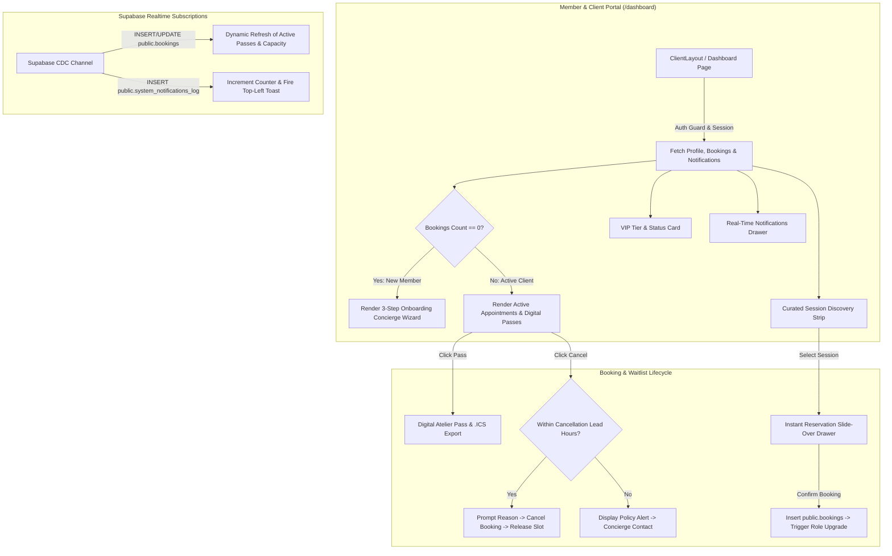

# Implementation Plan: Member & Client Dashboard (`/dashboard`)

**Document**: `IMPLEMENTATION_CLIENT.md`  
**GitHub Tracking Issue**: [#11](https://github.com/irajba93-code/caramel-vibe/issues/11)  
**Git Branch**: `feat/member-and-client-dashboard`  
**Status**: Completed  

---

## 1. Executive Summary & User Story

As a registered member or atelier client of **Caramel Vibe**:
1. **Personalized Atelier Welcome & VIP Tier Governance**:
   Upon signing in, members need a personalized home dashboard displaying their account standing, avatar, membership tier (`user` vs `client`), and quick statistical counters for active reservations, waitlists, and completed visits. For first-time users (0 bookings), an elegant 3-step onboarding pathway guides them from profile setup to attending their first atelier session.

2. **Full-Lifecycle Booking Management & Digital Passes**:
   Clients require a unified appointment hub to view upcoming reservations, check-in status, location details, guest slot allocation, and on-premise settlement indicators (`paid_on_premise` / `pending_on_premise`). Each upcoming booking includes a **Digital Atelier Access Pass**, `.ics` calendar sync (Google / Apple Calendar), and an interactive **Cancellation Request** dialog with real-time enforcement of the studio's cancellation notice window (`cancellation_lead_hours`).

3. **Waitlist Tracking & Priority Promotion**:
   Clients can monitor active waitlist positions for sold-out sessions, view real-time promotion statuses, and claim open spots as soon as capacity becomes available.

4. **Curated Session Discovery & Instant Reservation Drawer**:
   A live calendar/carousel strip showcasing upcoming published atelier sessions with remaining capacity meters (`X slots remaining`) and an embedded 1-click **Reservation Drawer** allowing seamless bookings without leaving the dashboard.

5. **Real-Time Notifications & Concierge Feed**:
   Live synchronized alerts from `system_notifications_log` via Supabase Realtime CDC (`INSERT` / `UPDATE`), supporting unread counters, mark-as-read persistence, and instant top-left toast notifications.

---

## 2. System Architecture & Data Flow

---

## 3. Key Modules & Technical Specifications

### Module A: Hero Welcome, VIP Tier & New User Onboarding
1. **Welcome Banner**:
   - Personalized greeting with full name, avatar, and active role pill (`Standard Member` vs `Verified Atelier Client`).
   - Account standing badge (`Verified Active` / `Restricted`).
   - Quick KPI statistics:
     - *Active Appointments*
     - *Active Waitlists*
     - *Lifetime Atelier Visits*
2. **New Member Onboarding Pathway (Conditional for 0 Bookings)**:
   - Step 1: *Personal Dossier Setup* (Link to `/client/profile`).
   - Step 2: *Browse Archival Sessions & Styling Consultations*.
   - Step 3: *Attend On-Premise & Unlock Client VIP Privileges*.

---

### Module B: Booking Management Hub & Digital Passes
1. **Segmented Tab Views**:
   - `Upcoming Appointments` (Active reservations).
   - `Waitlist Queue` (Queued waitlist entries with live queue status).
   - `Past Visits Archive` (Completed sessions & payment receipt records).
2. **Appointment Pass Card Design**:
   - Session title, category badge, and studio location address.
   - Date & start/end time display with clock icon.
   - Capacity / reserved slots count and total cost with currency (`CAD`).
   - Payment status badge (`Pending On-Premise` vs `Settled On-Premise`).
   - Check-in status (`Confirmed`, `Checked In`).
3. **Interactive Booking Controls**:
   - **Digital Access Pass Modal**: High-contrast luxury pass view with booking reference `#BK-XXXX`, session details, and studio check-in instructions.
   - **Add to Calendar**: Generates and downloads standard `.ics` calendar events for Apple Calendar, Google Calendar, and Outlook.
   - **Cancellation Dialog**:
     - Calculates difference between current time and session `start_time`.
     - Validates against `app_settings.cancellation_lead_hours` (default 24h).
     - Allows member to specify a cancellation reason, updates booking status to `cancelled`, and decrements session `booked_slots`.
     - Displays top-left toast feedback upon completion.

---

### Module C: Curated Atelier Discovery & Instant Booking Drawer
1. **Live Session Availability Feed**:
   - Queries `sessions` with `status = 'published'` and `start_time > NOW()`.
   - Displays session category, duration, price, and visual occupancy meter.
2. **Instant Slide-Over Reservation Drawer**:
   - Opens right-hand drawer pre-filled with selected session details.
   - Slot selector (`1` to `available_slots`).
   - Special styling or consultation notes input.
   - Immediate booking confirmation with auto-refresh of user dashboard passes.

---

### Module D: Real-Time Notification Center & Concierge Alerts
1. **Notification Popover / Drawer**:
   - Queries `system_notifications_log` for the authenticated `recipient_id`.
   - Shows notification icon, subject, timestamp, and unread marker.
   - Actions: `Mark as Read`, `Mark All as Read`.
2. **Realtime CDC Channel**:
   - Subscribes to `postgres_changes` on `system_notifications_log` filtered by `recipient_id`.
   - Plays top-left toast notification when a new alert is received.

---

## 4. Implementation Checklist & Progress Tracker

### Phase 1: Planning & Architecture
- [x] Create `IMPLEMENTATION/IMPLEMENTATION_CLIENT.md`.
- [x] Align with user requirements and finalize scope.

### Phase 2: Client Data Layer & Realtime Context
- [x] Create client data hydration with profile, bookings, waitlists, available sessions, and notifications.
- [x] Implement queries for:
  - [x] User profile & standing (`profiles`).
  - [x] Active & historical reservations (`bookings` joined with `sessions`).
  - [x] Active waitlist positions (`session_waitlists` joined with `sessions`).
  - [x] Available upcoming sessions for discovery (`sessions`).
  - [x] Live notifications (`system_notifications_log`).
- [x] Setup Supabase Realtime subscriptions on `bookings` and `system_notifications_log`.

### Phase 3: Dashboard Layout, Hero Banner & VIP Tier Card
- [x] Implement responsive luxury header with avatar, role badge, and fast profile jump.
- [x] Build KPI summary cards (Active Reservations, Waitlists, Visits).
- [x] Build conditional 3-Step Onboarding Guide for new members.

### Phase 4: Booking Management, Passes & Cancellation Modal
- [x] Build segmented tabs (`Upcoming`, `Waitlist`, `Past Visits`).
- [x] Build luxury appointment cards with status indicators.
- [x] Build **Digital Atelier Access Pass** modal.
- [x] Implement `.ics` calendar file export helper.
- [x] Build **Cancellation Dialog** with lead-time validation and database updates.

### Phase 5: Curated Discovery & Instant Booking Drawer
- [x] Build upcoming sessions carousel/grid with live capacity meters.
- [x] Build slide-over reservation drawer with slot picker and notes.
- [x] Implement booking creation and trigger state refresh.

### Phase 6: Realtime Notification Center & Toast Feedback
- [x] Build notification popover/drawer in client header.
- [x] Wire mark-as-read and mark-all-as-read database mutations.
- [x] Connect new notifications to top-left toast alert triggers.

### Phase 7: Verification, QA & Route Synchronization
- [x] Ensure unified experience between `/dashboard` and `/client/dashboard`.
- [x] Validate responsive layout on desktop, tablet, and mobile.
- [x] Execute `pnpm build` and verify 0 TypeScript/ESLint errors.

---

## 5. Design Tokens & Visual Specifications

| Element | Specification / Token | Usage |
| :--- | :--- | :--- |
| **Canvas Background** | `bg-background` (`#f8f3eb` Linen Cream) | Main client portal surfaces |
| **Card / Surface** | `bg-card` (`#ffffff` / `#fffaf3` Ivory) | Appointment cards, Dossier cards, Drawers |
| **Text Primary** | `text-foreground` (`#3b2720` Espresso) | Headings, Session titles, Pass identifiers |
| **Text Muted** | `text-muted-foreground` (`#806d61` Warm Taupe) | Subtitles, Timestamps, Studio addresses |
| **Primary Accent** | `text-primary` (`#a85d35` Caramel Terracotta) | Reserve buttons, Active tabs, Pass highlights |
| **Gold / Honey Accent** | `text-accent` (`#c99555` Honey Ochre) | VIP tier badges, Star indicators |
| **Success Status** | `#3e6b48` Forest Sage | Confirmed status, Checked-in badge, Verified |
| **Pending / Warning** | `#c2782b` Amber Ochre | Pending on-premise payment, Waitlisted |
| **Destructive / Error** | `#9e3b32` Terracotta Crimson | Cancellation action, Lead time notices |
| **Toasts** | Fixed Top-Left (`top-4 left-4 z-50`) | Standard Caramel Vibe Toast System |
