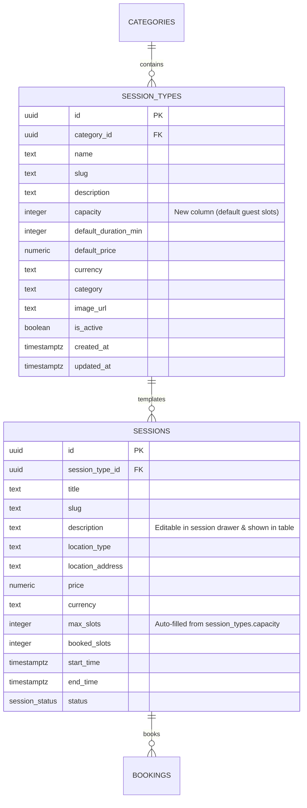

# Implementation Plan: Session Type Capacity, Auto-Fill & Enhanced Table/Drawer Interactions

**Document**: `IMPLEMENTATION_DB_CAPACITY.md`  
**GitHub Tracking Issue**: [#9](https://github.com/irajba93-code/caramel-vibe/issues/9)  
**Git Branch**: `feat/session-type-capacity-and-drawer-enhancements`  
**Status**: Ready for Execution  

---

## 1. Executive Summary & User Story

As an Atelier Administrator for Caramel Vibe, when defining reusable session types (templates), we need the ability to specify a default **Capacity** (number of guest slots) and **Description** so that when scheduling a new master session, selecting a session type automatically populates the capacity.

Furthermore, we need our admin tables and interactive sheets (drawers) enhanced with:
1. **Session Types UI Table**: Displaying `Description` (after title) and `Capacity` columns.
2. **Master Active Sessions Table**: Displaying a `Description` column after the session title/category.
3. **Interactive Table Rows & Category Cards**: Clicking anywhere on a table row or category item (`cursor-pointer`) opens the right-side details/edit drawer (Sheet).
4. **Accessible Sheet Overlay & Dismissal**: Full backdrop overlay (`fixed inset-0 bg-black/50 backdrop-blur-xs`), clicking outside the drawer onto the blurred/darkened backdrop closes the drawer, pressing the `Escape` key closes the drawer, and clicking the `X` icon closes the drawer.

---

## 2. Database Schema & Supabase Architecture



### Database Migration Details
- Add column `capacity` (`integer`, nullable) to `public.session_types`:
  ```sql
  ALTER TABLE public.session_types ADD COLUMN IF NOT EXISTS capacity integer;
  ```
- Seed existing template records with baseline capacities (e.g. 1, 6, 8) to maintain data consistency.

---

## 3. Implementation Checklist & Progress Tracker

### Phase 1: Database & Model Synchronization
- [x] **1.1 Supabase Schema Migration**
  - [x] Execute `ALTER TABLE public.session_types ADD COLUMN IF NOT EXISTS capacity integer;` via Supabase MCP.
  - [x] Verify column addition via `list_tables`.
- [x] **1.2 TypeScript Definitions**
  - [x] Update `SessionType` in `lib/supabase/types.ts` to include `capacity: number | null`.
  - [x] Update `AdminSessionType` in `lib/admin/mockData.ts` to include `capacity?: number | null`.
  - [x] Update `INITIAL_SESSION_TYPES` in `lib/admin/mockData.ts` with initial capacity values.
- [x] **1.3 Data Context Operations (`AdminMockContext.tsx`)**
  - [x] Update Supabase fetch query mapping for `session_types` to extract `capacity`.
  - [x] Update `addSessionType` to pass `capacity` to Supabase `insert` payload and state.
  - [x] Update `updateSessionType` to persist `capacity` in Supabase `update` payload and state.
  - [x] Implement `deleteSessionType` helper.

---

### Phase 2: Session Types (Templates) UI & Modals
- [x] **2.1 Session Type Create / Edit Modal (`app/(admin)/admin/sessions/page.tsx`)**
  - [x] Implement full Create / Edit Session Type modal dialog with backdrop and escape handling.
  - [x] Add `Capacity (Default Guests)` input field:
    - Default empty (`""` / `null`) on Create.
    - Pre-filled with `st.capacity` on Edit.
  - [x] Include Category selector, Title, Slug, Description, Duration, Price, Currency, Image URL, and Active status.
- [x] **2.2 Session Types Template UI Table**
  - [x] Implement a rich structured data table under `activeTab === 'types'`.
  - [x] Add `Description` column directly after the Session Name/Title.
  - [x] Add `Capacity` column displaying guest count (e.g., `6 guests` or `—`).
  - [x] Add `Duration`, `Category`, `Default Price`, `Status`, and `Actions` columns.
  - [x] Make entire table rows and cards clickable (`cursor-pointer`) to open the edit modal/drawer.

---

### Phase 3: Master Sessions Table & Scheduling Auto-Fill
- [x] **3.1 Session Scheduling Drawer (`openCreateSession`)**
  - [x] Ensure `Session Type` selector is present and synced.
  - [x] When a session type is selected from the dropdown, automatically pre-fill `max_slots` (Capacity) with `selectedType.capacity`.
  - [x] Ensure `description` field is prominent and editable during session creation.
- [x] **3.2 Session Edit Drawer (`openEditSession`)**
  - [x] Ensure `description` field is loaded and editable.
  - [x] Allow manual adjustments to capacity (`max_slots`) if needed.
- [x] **3.3 Master Active Sessions Table UI**
  - [x] Add `Description` column directly following the `Session & Category` column.
  - [x] Style description with elegant line-clamp/truncation (`text-muted-foreground text-xs`).
  - [x] Make the entire `<tr>` row clickable with `cursor-pointer` to open the right-side viewing/details Sheet drawer.
  - [x] Add `e.stopPropagation()` on all inline action buttons (Pencil Edit, Eye View, Trash Delete) to preserve granular button interactions.
- [x] **3.4 Service Categories Interaction**
  - [x] Ensure Category cards/rows are clickable (`cursor-pointer`) to open the category edit modal.

---

### Phase 4: Sheet Drawer Backdrop Overlay & Dismissal Controls
- [x] **4.1 Full Backdrop Overlay**
  - [x] Ensure all drawers (`viewingSession` drawer, `sessionDrawerOpen` drawer) render with a full backdrop overlay (`fixed inset-0 z-50 bg-black/50 backdrop-blur-xs flex justify-end`).
- [x] **4.2 Click Outside to Dismiss**
  - [x] Ensure clicking on the blurred/darkened backdrop outside the drawer sheet automatically closes the active drawer.
- [x] **4.3 Escape Key & Close Icon**
  - [x] Add global `keydown` event listener for `Escape` key to close any active drawer/modal.
  - [x] Verify top-right `X` icon cleanly closes the drawer.

---

### Phase 6: Live Capacity & Booking Synchronization
- [x] **6.1 Live Booked Slots Aggregation (`context/AdminMockContext.tsx`)**
  - [x] Map `booked_slots` dynamically from active (non-cancelled) bookings in Supabase hydration.
  - [x] Update `addBooking` to compute and increment booked slots and set status to `full` when capacity is reached.
  - [x] Update `cancelBooking` to deduct slots and restore session status to `published` if it was previously `full`.
- [x] **6.2 Dynamic UI Rendering (`app/(admin)/admin/sessions/page.tsx`)**
  - [x] Compute live capacity via `getSessionLiveBookedSlots(sessionId, fallbackBooked)`.
  - [x] Update Master Sessions table, grid cards, and KPI overview to reflect live fill rates and occupancy percentages.
  - [x] Update `viewingSession` slide-over drawer occupancy gauge and attendee capacity bar with live computed values.
  - [x] Update `deleteConfirmSession` modal warning with live attendee count.

---

### Phase 7: Verification & Quality Assurance
- [x] **7.1 Build & Lint Check**
  - [x] Execute `pnpm build` and verify 0 TypeScript/ESLint errors.
- [x] **7.2 End-to-End Functional Walkthrough**
  - [x] Create a new Session Type with capacity -> verify saved and rendered on table.
  - [x] Edit Session Type -> verify capacity loaded and updated.
  - [x] Schedule Session -> verify choosing Session Type auto-populates capacity.
  - [x] Check Master Sessions table -> verify Description column & row clickability.
  - [x] Verify Backdrop click, Escape key, and X icon dismiss drawers seamlessly across Sessions, Clients, and Bookings.
  - [x] Verify live session capacity updates reactively when bookings are made or cancelled.
- [x] **7.3 GitHub Tracking Update**
  - [x] Update issue #9 checkboxes and post completion summary comment.
