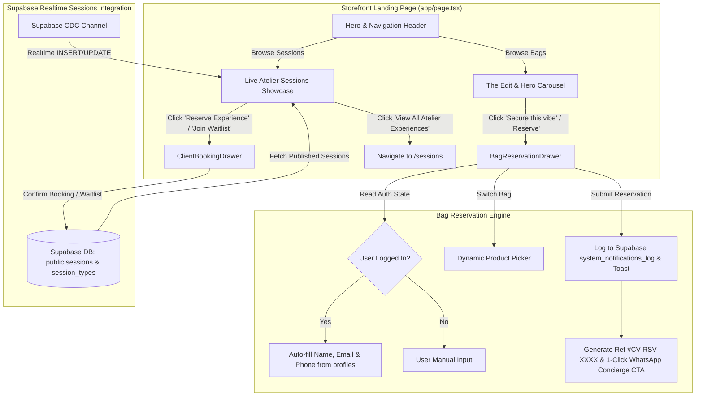

# Implementation Plan: Landing Page Live Atelier Sessions & Bag Reservation Upgrade

**Document**: `IMPLEMENTATION_LANDING_PAGE.md`  
**GitHub Tracking Issue**: [#13](https://github.com/irajba93-code/caramel-vibe/issues/13)  
**Git Branch**: `feat/landing-page-sessions-and-bag-reservation`  
**Status**: In Progress  

---

## 1. Executive Summary & User Story

As a visitor, prospective client, or registered member visiting **Caramel Vibe** (`/`):
1. **Live Atelier Sessions Showcase**:
   Directly on the storefront homepage, explore upcoming published atelier and studio experiences (Bespoke Bag Styling, Heirloom Authentication, Leather Preservation Masterclasses, Private Trunk Shows). See real-time dates, durations, pricing, locations, and live capacity meters (`X spots left` / `Waitlist`). Click to instantly reserve a spot or join a waitlist via the seamless slide-over `ClientBookingDrawer` without losing browsing state, or click to explore the full `/sessions` calendar.

2. **Luxury Bag Reservation Experience**:
   When securing a one-of-one archival handbag, experience an elevated, accessible, and high-touch reservation process. The slide-over drawer supports dynamic bag switching, pre-populates member credentials (name, email, phone) for logged-in clients, records the reservation into Supabase, and provides an instant one-click WhatsApp Concierge connection pre-filled with the inquiry details and reference code (`#CV-RSV-XXXX`).

3. **Accessibility & Responsive Luxury UX**:
   Full support for modal accessibility (backdrop blur and click-to-dismiss, `Escape` key close listener, background body scroll locking, and ARIA dialog properties) aligned with Caramel Vibe's warm neutral aesthetic.

---

## 2. System Architecture & Data Flow

---

## 3. Key Modules & Technical Specifications

### Module A: Live Atelier Sessions Showcase (`LandingSessionsShowcase.tsx`)
1. **Data Ingestion & Realtime Sync**:
   - Query `public.sessions` for `status = 'published'` and `start_time > now()`.
   - Join/map with `session_types` to retrieve category labels (e.g. *Masterclass*, *Bespoke Styling*, *Authentication*).
   - Realtime CDC listener on `sessions` and `bookings` tables to maintain live capacity numbers without page refresh.
2. **Editorial UI Presentation**:
   - Header with category eyebrow, warm editorial typography (*"Private Salons & Atelier Experiences"*), and link to `/sessions`.
   - Responsive grid of luxury experience cards:
     - Category pill & Price badge (e.g., `CAD $250`).
     - Session Title & Short description.
     - Formatted Date, Time range, and Studio Location.
     - Live Capacity Progress Meter with remaining spots indicator.
     - Action Button: **"Reserve Spot"** (if available) or **"Join Waitlist"** (if full).
3. **Integrated Booking Drawer**:
   - Direct trigger into `ClientBookingDrawer` with the selected session pre-loaded.

---

### Module B: Enhanced Bag Reservation Drawer (`BagReservationDrawer.tsx`)
1. **Bag Switcher & Preview**:
   - High-resolution product thumbnail, name, price, and condition badge (*"Archival One-of-One · Authenticated"*).
   - In-drawer piece selector allowing users to switch between available bags without closing the drawer.
2. **Authenticated Member Auto-Fill**:
   - Hydrates `full_name`, `email`, and `phone` directly from the authenticated Supabase `profiles` table.
3. **Controlled Inputs & Validation**:
   - Inputs for Name, Email, Phone/WhatsApp, Shipping Address, and Payment Preference.
   - Live validation and error states with top-left toast feedback.
4. **Supabase Record Persistence**:
   - Records inquiry into Supabase `system_notifications_log` / audit trails for administrator and concierge follow-up.
5. **Post-Reservation Screen**:
   - Generated inquiry reference code (e.g., `#CV-RSV-8492`).
   - Direct 1-click **"Connect on WhatsApp Concierge"** link pre-filled with bag name, reference code, and client contact.
   - Clear expectation message (*"Concierge will connect within 2 hours"*).
6. **Luxury Modal UX & Accessibility**:
   - Fixed darkened backdrop with click-outside-to-close.
   - `Escape` key listener.
   - Automatic `document.body.style.overflow = 'hidden'` scroll locking when active.
   - ARIA `role="dialog"`, `aria-modal="true"`.

---

### Module C: Storefront Main Page Assembly (`app/page.tsx`)
1. **Layout Reorganization**:
   - Integrate `LandingSessionsShowcase` section seamlessly into the editorial layout.
   - Connect Header "Reserve" button and Hero CTAs to `BagReservationDrawer`.
   - Update navigation anchors (`#edit`, `#atelier`, `#story`, `#faq`, `/sessions`).

---

### Module D: Authentication Gating & Intent Redirect Recovery
1. **Bag Reservation Auth Gating**:
   - When an unauthenticated user triggers bag reservation (from Header, Hero, The Edit, or Story), intercept and redirect to `/login?redirect=${encodeURIComponent('/?reserveBag=' + product.name)}`.
   - Upon successful login, user is routed back to `/?reserveBag=[name]`, which detects the intent query param and immediately resumes/opens the reservation drawer with their authenticated profile pre-filled.
2. **Session Booking Auth Gating & Return Path**:
   - When an unauthenticated user clicks "Reserve Experience" or "Join Priority Waitlist" (from Landing Showcase or `/sessions`), redirect directly to `/login?redirect=${encodeURIComponent('/?bookSessionId=' + session.id)}` or `/login?redirect=${encodeURIComponent('/sessions?bookSessionId=' + session.id)}`.
   - Upon login, user is redirected straight back into the modal/drawer with their selected session loaded, ready to confirm with 1 click.

---

### Module E: Reserved Handbags Client View (`/dashboard` & `/client/dashboard`)
1. **Dashboard Handbag Inquiries Hub**:
   - New **"Reserved Handbags"** tab added to the member dashboard tab bar.
   - Real-time hydration of user's handbag reservation inquiries from `system_notifications_log` (`notification_type = 'bag_reservation_inquiry'`).
   - Card layout displaying product image, title, price, reference code (`#CV-RSV-XXXX`), timestamp, settlement preference, and shipping address.
   - Status badge indicator (`Pending Concierge Confirmation`, `Confirmed`) and 1-click direct WhatsApp Concierge link.
   - Quick KPI metric counter in member hero summary.

---

### Module F: Live Database Integration & Realtime Notifications
1. **Dual Notification Ingestion**:
   - Handbag reservations write to `public.system_notifications_log` (with `recipient_id = user.id` and `status = 'unread'`) and `public.admin_audit_logs`.
   - Session bookings write to `public.bookings` and `public.system_notifications_log` (`notification_type = 'booking_confirmation'`).
2. **Supabase Realtime CDC Alerting**:
   - Realtime channels on `system_notifications_log` and `bookings` trigger instant badge updates, unread counter increments, and top-left screen toasts without manual page refresh.
   - `ClientNotificationCenter` renders luxury shopping bag / event icons for all notification types.

---

## 4. Implementation & Tracking Checklist

- [x] **1. Preparation & Tracking:**
  - [x] Create GitHub tracking issue [#13](https://github.com/irajba93-code/caramel-vibe/issues/13).
  - [x] Create and checkout branch `feat/landing-page-sessions-and-bag-reservation`.
  - [x] Create implementation tracking document `IMPLEMENTATION/IMPLEMENTATION_LANDING_PAGE.md`.

- [x] **2. Initial Showcase & Bag Reservation Drawer:**
  - [x] Implement slide-over drawer with luxury styling and backdrop.
  - [x] Add dynamic product selector for switching bags inside drawer.
  - [x] Add profile auto-fill for authenticated users.
  - [x] Implement controlled form inputs and validation.
  - [x] Add accessibility: ESC key, backdrop click, body scroll locking, ARIA dialog.
  - [x] Add luxury confirmation screen with reference code & WhatsApp Concierge link.
  - [x] Embed Live Atelier Sessions Showcase on landing page with category mapping and CDC sync.

- [x] **3. Authentication Gating & Intent-Preserving Redirects:**
  - [x] Intercept unauthenticated bag reservation clicks and redirect to `/login?redirect=/?reserveBag=[name]`.
  - [x] Intercept unauthenticated session booking clicks and redirect to `/login?redirect=/?bookSessionId=[id]` (or `/sessions?bookSessionId=[id]`).
  - [x] Implement searchParams intent detection on landing page to auto-reopen the target bag drawer or session booking modal upon sign-in.
  - [x] Implement searchParams intent detection on `/sessions` page to auto-open booking drawer upon sign-in.

- [x] **4. User Reserved Handbags Visibility in Client Dashboard (`/dashboard`):**
  - [x] Add **"Reserved Handbags"** tab to client dashboard view.
  - [x] Hydrate user's handbag reservation inquiries from `system_notifications_log`.
  - [x] Render luxury handbag reservation cards with reference code, status, timestamp, and WhatsApp CTA.
  - [x] Add metric counter in hero summary.
  - [x] Subscribe to Supabase Realtime CDC for live updates.

- [x] **5. Live Database Integration & Realtime Notifications:**
  - [x] Ensure handbag reservations insert structured `system_notifications_log` and `admin_audit_logs` records.
  - [x] Ensure session bookings insert structured `system_notifications_log` confirmation records.
  - [x] Update `ClientNotificationCenter` with tailored iconography for bag reservation inquiries.
  - [x] Verify instant top-left toast alerts on Realtime `INSERT` events.

- [x] **6. Quality Assurance & Build Verification:**
  - [x] Run `pnpm build` to verify 0 TypeScript/ESLint errors.
  - [x] Test end-to-end auth redirect flow for both bag reservations and atelier session bookings.
  - [x] Verify reserved handbags appear dynamically in client dashboard.
  - [x] Update GitHub issue [#13](https://github.com/irajba93-code/caramel-vibe/issues/13) with final report.
