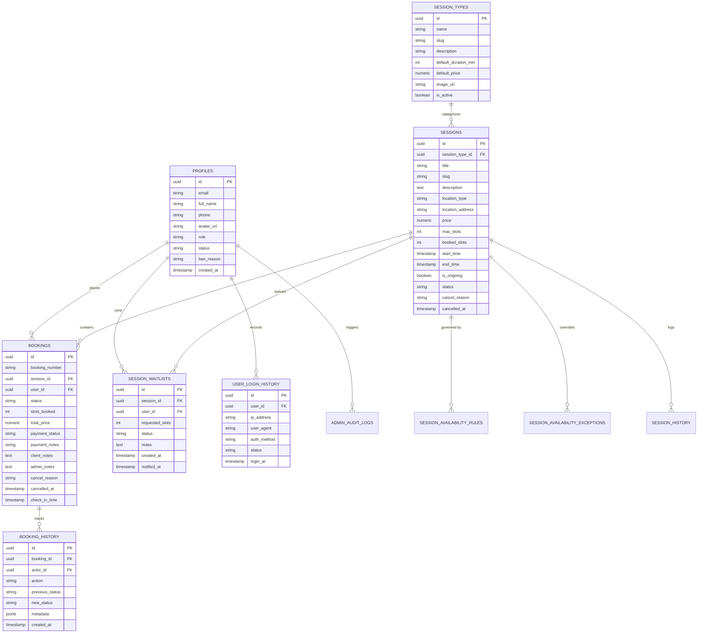

# Caramel Vibe — Backend & Dashboards Implementation Plan

---

## 1. System Overview & Technology Stack

- **Framework**: Next.js (App Router) + React 19 + TypeScript.
- **Styling**: Tailwind CSS v4 configured with Caramel Vibe custom luxury editorial design tokens.
- **Backend & Database**: Supabase (PostgreSQL, Auth, Storage, Edge Functions, and DB Triggers).
- **Component Architecture**: Built following **Shadcn UI** accessibility and API patterns, customized to the warm aesthetic of Caramel Vibe.
- **Toast Notifications**: Screen toast system anchored to the **Top-Left** (`top-4 left-4 z-50`).
- **Routing Strategy**: Dedicated slug-based pages for all primary operations; modals reserved strictly for confirmation dialogs, cancellation reasons, and ban/reject forms.
- **Payment Strategy**: In-person / On-premises settlement (`pending_on_premise`, `paid_on_premise`, `waived`), designed with a plug-and-play schema for future Stripe integration.
- **Waitlist System**: Integrated queue allowing clients to join a waitlist when sessions are at capacity, with admin promotion tools.
- **Notifications**: Transactional emails and webhook triggers for booking confirmations, cancellations, and waitlist alerts.

---

## 2. Luxury Brand & Design System Guide (Shadcn Reference)

### Color Tokens
| Variable | Hex Value | Semantic Usage |
| :--- | :--- | :--- |
| `background` | `#f8f3eb` | Primary page canvas (Warm Linen Cream) |
| `foreground` | `#3b2720` | Headings, body text, primary icons (Deep Espresso Roast) |
| `card` / `surface` | `#fffaf3` | Cards, modals, sidebars, data tables (Warm Alabaster) |
| `muted` | `#eadfd2` | Subtle backgrounds, dividers, badges (Soft Sand) |
| `muted-foreground` | `#806d61` | Timestamps, subtitles, helper text (Warm Earth Taupe) |
| `primary` | `#a85d35` | CTA buttons, active state highlights (Caramel Terracotta) |
| `primary-foreground` | `#fffaf3` | Text on primary buttons (Warm Alabaster) |
| `accent` | `#c99555` | VIP badges, ongoing markers, icons (Golden Caramel Honey) |
| `border` | `#dfcdbb` | High-contrast hairline borders (Warm Tan Hairline) |
| `destructive` | `#9e3b32` | Cancel actions, bans, rejection alerts (Terracotta Crimson) |
| `success` | `#3e6b48` | Confirmed bookings, checked-in status, paid marks (Forest Sage) |
| `warning` | `#c2782b` | Pending confirmation, waitlist status (Amber Ochre) |

### Typography & Layout Rules
- **Headings & Brand Title**: `Georgia, serif` (`font-display`) with italic accents (`<em className="text-primary">...</em>`).
- **Body & Form Controls**: `Inter / Arial, sans-serif`.
- **Eyebrow Headers**: `text-[11px] font-bold uppercase tracking-[0.16em] text-primary`.
- **Component Styling**: Clean, sharp/subtle borders (`border border-border bg-card`), smooth hover states (`hover:-translate-y-0.5 transition-all`).

---

## 3. Database Schema & Data Models (Supabase PostgreSQL)



### Table Definitions & Triggers

1. **`profiles`**:
   - `id` (UUID PK references `auth.users`), `email`, `full_name`, `phone`, `avatar_url`, `role` (`'admin' | 'client' | 'user'`), `status` (`'active' | 'banned' | 'rejected'`), `ban_reason`, `created_at`, `updated_at`.
2. **`session_types`**:
   - `id`, `name`, `slug`, `description`, `default_duration_min`, `default_price`, `currency`, `category`, `image_url`, `is_active`, timestamps.
3. **`sessions`**:
   - `id`, `session_type_id`, `title`, `slug`, `description`, `location_type`, `location_address`, `price`, `currency`, `max_slots`, `booked_slots`, `start_time`, `end_time`, `is_ongoing`, `status` (`'draft' | 'published' | 'full' | 'completed' | 'cancelled'`), `cancel_reason`, `cancelled_at`, `created_by`, timestamps.
4. **`session_waitlists`**:
   - `id`, `session_id`, `user_id`, `requested_slots`, `status` (`'waiting' | 'notified' | 'promoted' | 'cancelled'`), `notes`, `created_at`, `notified_at`.
5. **`session_availability_rules` & `session_availability_exceptions`**:
   - **Rules**: Weekly recurring operating windows (`day_of_week`, `start_time`, `end_time`, `valid_from`, `valid_until`).
   - **Exceptions**: Blackout dates (holidays, closures) and custom operating hour overrides.
6. **`bookings`**:
   - `id`, `booking_number`, `session_id`, `user_id`, `slots_booked`, `total_price`, `currency`, `status` (`'confirmed' | 'pending_confirmation' | 'completed' | 'cancelled' | 'no_show'`), `payment_status` (`'pending_on_premise' | 'paid_on_premise' | 'waived' | 'refunded'`), `payment_notes`, `client_notes`, `admin_notes`, `cancel_reason`, `cancelled_at`, `cancelled_by`, `check_in_time`, timestamps.
7. **`booking_history`, `session_history`, `user_login_history`, `admin_audit_logs`, `system_notifications_log`**:
   - Immutable audit logs capturing state transitions, user IP/user-agents, admin moderation decisions, and outbound notifications.
8. **Automated Database Triggers**:
   - **User creation trigger**: Auto-creates `profiles` row on auth sign-up.
   - **Role promotion trigger**: Upgrades `user` to `client` upon booking their first session.
   - **Capacity sync trigger**: Auto-updates `booked_slots` and marks session as `full` or `published`.
   - **Cancellation audit trigger**: Records reasons and updates inventory when appointments are cancelled.

---

## 4. Page Architecture & Route Map

```
app/
├── (public)/
│   ├── page.tsx                           # Landing page + Live Atelier Sessions showcase
│   ├── sessions/
│   │   ├── page.tsx                       # Public Catalog & Category Filters
│   │   └── [slug]/
│   │       └── page.tsx                   # Public Session Details, Slot Picker & Waitlist Form
│   ├── login/
│   │   └── page.tsx                       # Unified Sign In + Fast Demo Switcher
│   ├── signup/
│   │   └── page.tsx                       # New User Registration (initial role: 'user')
│   ├── forgot-password/
│   │   └── page.tsx                       # Password Reset Request
│   └── reset-password/
│       └── page.tsx                       # Password Update Page
├── (client)/
│   └── client/
│       ├── layout.tsx                     # Client Portal Navigation & Session Guard
│       ├── dashboard/
│       │   └── page.tsx                   # Client Overview (Upcoming Countdown, Stats)
│       ├── bookings/
│       │   └── page.tsx                   # Bookings & Waitlist Tabs (Upcoming, Past, Waitlist)
│       ├── bookings/[id]/
│       │   └── page.tsx                   # Dedicated Booking Dossier (.ics export, Cancel Modal)
│       └── profile/
│           └── page.tsx                   # Profile Preferences & Avatar Upload
├── (admin)/
│   └── admin/
│       ├── layout.tsx                     # Admin Console Layout & RBAC Security Guard
│       ├── dashboard/
│       │   └── page.tsx                   # KPI Cards, In-Person Revenue, Live Attendance
│       ├── sessions/
│       │   ├── page.tsx                   # Master Sessions Table & Status Tabs
│       │   ├── new/
│       │   │   └── page.tsx               # Dedicated Create Session Page
│       │   └── [id]/
│       │       ├── page.tsx               # Attendee Roster, Waitlist Queue & Quick Check-In
│       │       ├── edit/
│       │       │   └── page.tsx           # Dedicated Edit Session Page
│       │       └── availability/
│       │           └── page.tsx           # Weekly Rules & Blackout Exceptions Manager
│       ├── session-types/
│       │   └── page.tsx                   # Reusable Session Types Catalog CRUD
│       ├── bookings/
│       │   ├── page.tsx                   # Master Bookings Ledger with Filters & CSV Export
│       │   └── [id]/
│       │       └── page.tsx               # Dedicated Booking Dossier, Admin Notes, Audit Log
│       ├── clients/
│       │   ├── page.tsx                   # Client Directory (Role/Status Filters, Ban/Reject Modals)
│       │   └── [id]/
│       │       └── page.tsx               # Client Dossier (Lifetime Bookings, Login History, Notes)
│       ├── reporting/
│       │   └── page.tsx                   # Capacity Utilization, Cancellation Rates, Revenue
│       ├── logs/
│       │   └── page.tsx                   # Audit Logs & Login Activity Viewer
│       └── settings/
│           └── page.tsx                   # Studio Locations, Policies & Notification Templates
└── api/
    ├── auth/
    │   ├── callback/route.ts              # Supabase Code Exchange Route
    │   └── record-login/route.ts          # Login IP & User-Agent Logger
    └── notifications/
        └── dispatch/route.ts              # Transactional Notification Dispatcher
```

---

## 5. Step-by-Step Implementation Roadmap

1. **Phase 1: Database Setup & Infrastructure & Universal User Profile (✅ Completed)**:
   - Supabase PostgreSQL schema migrations (complete all tables: `profiles`, `session_types`, `sessions`, `session_waitlists`, `session_availability_rules`, `session_availability_exceptions`, `bookings`, `booking_history`, `session_history`, `user_login_history`, `admin_audit_logs`, `system_notifications_log`).
   - Automated DB triggers (auto-create profile on auth signup, auto-promote `user` to `client` on booking, capacity sync, cancellation audit).
   - Row-Level Security (RLS) policies for user, client, and admin roles with self-update permissions on `profiles`.
   - Storage buckets configuration for avatar (`avatars`) and session media with authenticated upload policies and private signed-URL delivery.
   - **Universal User Profile Page (`/client/profile`)**:
     - Role-agnostic profile management accessible to all authenticated roles (`user`, `client`, `admin`).
     - Display, formatting, and management of all 10 schema fields from `public.profiles`:
       - `id`: Account UUID card with monospace styling, copy-to-clipboard action, and toast confirmation.
       - `email`: Read-only verified login email with security explanatory badge.
       - `full_name`: Editable full name text input with real-time state synchronization.
       - `phone`: Editable contact/WhatsApp telephone input with helper copy.
       - `avatar_url`: Supabase Storage upload (formats: JPG, PNG, WEBP, GIF; max 5MB), local preview, private signed-URL resolution via `Avatar.tsx`, and photo removal.
       - `role`: Access tier badge and governance card detailing privileges (`admin` / Atelier Administrator, `client` / Verified Atelier Client, `user` / Standard Member).
       - `status`: Account standing badge and indicator (`active`, `banned`, `rejected`).
       - `ban_reason`: Prominent administrative restriction notice banner and support concierge contact if restricted; good standing verification when active.
       - `created_at`: Formatted "Member Since" official registration date.
       - `updated_at`: Formatted "Last Profile Update" audit timestamp updating dynamically on profile save.
     - Top-left toast notifications for save/error states via `ToastContext`.
   - **Root Page Navigation & Profile Dropdown (`/` - `app/page.tsx`)**:
     - Standard modern profile avatar button in the root navigation header (replacing any static dashboard button).
     - Dynamic display of user avatar image if available, with graceful placeholder/initials fallback.
     - Interactive dropdown menu with:
       - User identity overview (Name, Email, Role badge).
       - Hyperlink navigation to Profile page (`/client/profile`).
       - Role-based navigation shortcuts (`/dashboard` for user/client, `/admin` for admin).
       - Preserved functional Sign Out action without modifying existing working logout logic.
     - Click-outside dismissal and accessible navigation.

   **Phase 1 Checklist**:
   - [x] Verify `profiles` table schema and RLS policies allow authenticated users to read and update their own record.
   - [x] Verify `avatars` storage bucket is provisioned with private signed URL access and authenticated write access.
   - [x] Implement universal Profile Page at `app/(client)/client/profile/page.tsx` supporting all role types (`user`, `client`, `admin`) with all 10 schema fields.
   - [x] Implement avatar upload and removal functionality with Supabase Storage integration.
   - [x] Update root page header in `app/page.tsx` to detect user authentication state.
   - [x] Replace static dashboard button with modern Profile Avatar button and placeholder fallback.
   - [x] Implement dropdown menu on root page with link to Profile page (`/client/profile`), role-based dashboard shortcuts, and preserved Log Out action.
   - [x] Verify end-to-end profile editing, copy UUID, and avatar sync across all user roles.

2. **Phase 2: Admin Operations UI Suite (Sessions, Categories, Clients & Bookings) & Database Foundations**:
   - **Database Foundations & Missing Schemas (Supabase)**:
     - Provision `categories` table (`id`, `name`, `slug`, `description`, `image_url`, `display_order`, `is_active`, timestamps) with RLS.
     - Link `session_types.category_id` $\rightarrow$ `categories.id`.
     - Provision `app_settings` table (`id`, `key`, `value` JSONB, `description`, timestamps) seeded with `max_booking_days_advance: 30`, `cancellation_lead_hours: 24`, studio details.
     - Synchronize TypeScript models in `lib/supabase/types.ts`.
   - **Admin UI Architecture & Layout Enhancements**:
     - **Collapsible Sidebar**: Responsive expanding/collapsing navigation shell with brand mark, active indicators, and quick store preview link.
       - Primary navigation links: **Sessions** (encompassing Sessions, Categories, Types, Availability), **Clients**, and **Bookings**.
     - **Header & Navigation Bar**:
       - Brand-consistent Profile Dropdown (matching root page with avatar, user info, role badge, profile link, and sign out).
       - **Minimal Real-Time Notification Center**: Bell icon with unread indicator and slide-out notification drawer.
       - **Contextual Quick Actions**: Dynamic primary CTA button tied to active view (`+ New Session`, `+ New Category`, `+ Record Booking`, `+ Invite Client`).
     - **Breadcrumbs Navigation**: Subtle hierarchical path indicator above the content area (e.g. `Admin / Sessions / Categories`).
     - **Executive KPI Summary Cards**:
       - 4 Luxury KPI cards (Active Sessions, Total Bookings, On-Premises Expected Revenue, Client Network).
       - **Trend Indicators** (e.g. `+14.2% vs last period`).
       - **Date Range Filter** (`Today`, `Last 7 Days`, `This Month`, `Custom`).
     - **Sessions View**: Sub-tabs for Atelier Sessions, Service Categories (full CRUD), Session Types, and Availability rules.
     - **Clients View**: Searchable directory, client dossier drawer/modals, lifetime bookings, and moderation tools (Ban with reason, Reject, Restore).
     - **Bookings View**: Master ledger, attendance check-in, in-person payment settlement, and cancellation workflows.
     - **UI Strategy**: Skip global search and skeleton states for now; validate complete UI and interactions with rich mock data and top-left toasts before wiring live Supabase CRUD.

    **Phase 2 Checklist**:
    - [x] Implement Collapsible Admin Sidebar with navigation for Dashboard, Sessions, Clients, and Bookings.
    - [x] Implement Mobile Off-Canvas Drawer (slide-over sheet with dark backdrop overlay) and desktop icon-only collapse mode with external/internal toggle controls.
    - [x] Implement brand-consistent Header with root-matching Profile Dropdown, Mobile Hamburger Trigger, and Minimal Notification Bell.
    - [x] Implement Breadcrumbs Navigation above content area.
    - [x] Implement Executive KPI Cards with dynamic calculations, Trend Indicators and Date Range Filter (`AdminKpiCards.tsx`).
    - [x] Implement Contextual Quick Action button dynamically bound to active tab.
    - [x] Implement Sessions view with sub-tabs for Sessions, Categories (CRUD), Session Types, and Availability.
    - [x] Implement full Sessions CRUD with live editing drawer, deletion confirmation dialog, details inspection drawer with attendee roster, and real-time capacity tracking.
    - [x] Implement Clients Directory view with search, filter, dossier drawer, client edit capabilities, moderation actions (ban with reason, reject, restore), anti-lockout self-protection, and "You" self-row badge.
    - [x] Implement Bookings Ledger view with 1-click check-in, payment status toggling, walk-in creation, and cancellation dialogs.
    - [x] Implement Multi-Field Column Ordering / Sorting (`SortableHeader`) across all admin tables (asc/desc with visual indicators).
    - [x] Implement Date Range Filtering (`AdminDateFilter`) with common presets (Today, Last 7 Days, Next 7 Days, This Month, All Time) and custom start/end date pickers.
    - [x] Implement Fully Functional Executive Admin Dashboard (`app/(admin)/admin/dashboard/page.tsx`) with fast guest lookup, live capacity gauges, 1-click check-ins with timestamps, dynamic agenda stats, and settings sync.
    - [x] Implement Recent Activities Feed (`AdminRecentActivities.tsx`) with interactive **Admin** and **Client** activity filter pills, search, and target navigation.
    - [x] Validate entire UI lifecycle and top-left toasts with rich interactive mock and live data state.
    - [x] Provision Supabase database tables (`categories`, `app_settings`, FK links) and RLS policies.
    - [x] Connect live Supabase CRUD and Realtime subscriptions.
    - [x] Resolve Supabase Auth schema triggers and populate `auth.identities` records for demo credentials.
    - [x] Seed live test bookings for standard User and VIP Client personas via Supabase MCP.

3. **Phase 3: Role Management & Live Integration**:
    - [x] Create and configure the Admin user in Supabase (`auth.users` + `profiles.role = 'admin'`).
    - [x] Configure password hashes with 10-round bcrypt and enable `user_login_history` RLS insert policy.
    - [x] Validate live data binding and role-switching lifecycle.

4. **Phase 4: Design System & Core Primitives**:
    - [x] Tailwind CSS tokens for Caramel Vibe luxury palette (Linen Cream `#f8f3eb`, Espresso `#3b2720`, Caramel Terracotta `#a85d35`, Honey `#c99555`).
    - [x] Screen toast system anchored to Top-Left (`top-4 left-4 z-50`).
    - [x] Reusable Shadcn-inspired UI components (Buttons, Cards, Dialogs, Badges, Table primitives, Date Pickers).

5. **Phase 5: Public Catalog, Booking & Waitlist**:
    - Live atelier sessions showcase and filterable public catalog (`/sessions`).
    - Public session detail with slot selection, on-premise payment options, and waitlist registration (`/sessions/[slug]`).
    - Auto-role promotion trigger validation (promotes `user` to `client` upon booking).
    - Transactional notification dispatch triggers.

6. **Phase 6: Full Client Portal**:
    - Client dashboard with upcoming appointment countdown, stats, and booking ledger (`/client/dashboard`, `/client/bookings`).
    - Dedicated booking dossier with `.ics` calendar export and cancellation dialog (`/client/bookings/[id]`).
    - Client profile preferences and avatar upload (`/client/profile`).

7. **Phase 7: Full Admin Operations Console**:
    - [x] Comprehensive admin dashboard with live revenue analytics, attendance roster, and quick actions (`/admin/dashboard`).
    - [x] Recent Activities & Audit Log feed with interactive **Admin / Client filters**, quick search, timestamps, and target references (`components/admin/AdminRecentActivities.tsx`).
    - [x] Sessions CRUD orchestration with live editing, deletion with confirmation dialogs, inspection drawer with attendee rosters, KPIs, schedule availability rules, and attendee check-in (`/admin/sessions`, `/admin/sessions/[id]/availability`).
    - [x] Master bookings ledger with status filters, sorting, date ranges, and 1-click check-in (`/admin/bookings`).
    - [x] Client directory with moderation tools (ban/reject dialogs), client editing, and client dossier (`/admin/clients`).
    - [x] Live studio parameters, settings sync, and real-time alerts.

8. **Phase 8: Build Verification & End-to-End Validation**:
    - [x] Production build validation (`pnpm build`) passing across all 19 application routes with 0 errors.
    - [x] End-to-end verification of all interactive workflows, responsive drawer layouts, sorting, filtering, and Top-Left toast feedback.