# Implementation Plan: Admin Avatar Moderation & Sessions Interactive Calendar View

**Document**: `IMPLEMENTATION_SC_&CA.md`  
**GitHub Tracking Issue**: [#10](https://github.com/irajba93-code/caramel-vibe/issues/10)  
**Git Branch**: `feat/sessions-calendar-and-client-avatars`  
**Status**: Ready for Execution  

---

## 1. Executive Summary & User Story

As an Atelier Administrator for Caramel Vibe:
1. **Client Section – Admin Avatar Moderation (`/admin/clients`)**:
   We need comprehensive administrative controls to upload, replace, and remove client avatar images directly inside the **Client Dossier** slide-over drawer and the **Edit Client Profile** modal. All photo management must integrate directly with Supabase Storage (`avatars` bucket), enforce strict validation rules (accepted types: `image/png`, `image/jpeg`, `image/webp`; maximum file size: `5MB`), generate secure signed URLs for display, and update the client directory in real time.

2. **Sessions & Templates – Calendar View (`/admin/sessions`)**:
   We need a luxury **Calendar View** alongside our existing List View in `/admin/sessions`. This includes a segmented view switcher toggle, an interactive luxury calendar grid (month navigation, day cells, today indicator), visual session event pills displaying publication statuses and live capacity fill rates (`booked / max`), and instant click-to-open interactions that launch the right-side slide-over edit drawer.

---

## 2. Architecture & Data Flow

```mermaid
flowchart TD
    subgraph Client_Avatar_Moderation ["1. Admin Avatar Moderation (/admin/clients)"]
        A[Client Dossier Slide-Over Drawer] -->|Select / Drop File| B[Client-Side File Validator]
        B -->|Check Type: PNG, JPG, WebP| C{Valid?}
        B -->|Check Size <= 5MB| C
        C -->|No| D[Top-Left Error Toast]
        C -->|Yes| E[Upload to Supabase Storage avatars Bucket]
        E -->|Get Storage Path| F[Update profiles.avatar_url & updated_at]
        F -->|Sync| G[AdminMockContext & UI Dynamic Re-render]
        A -->|Remove Photo Action| H[Delete from avatars bucket & set avatar_url = null]
        H --> G
    end

    subgraph Sessions_Calendar_View ["2. Sessions Calendar View (/admin/sessions)"]
        I[View Switcher Toggle] -->|Select Calendar View| J[Interactive Luxury Calendar Grid]
        J -->|Month Navigation & Today Jump| K[Compute Days of Month]
        K -->|Map Scheduled Sessions| L[Render Session Event Cards]
        L --> M[Display Title, Time, Status Pill & Capacity Fill Rate]
        L -->|Click Session Card| N[Open Right Slide-Over Edit Drawer]
        K -->|Click Empty Date Slot| O[Open Schedule Session Drawer Pre-filled with Date]
        N -->|Backdrop Click / Escape Key| P[Smooth Dismissal]
    end
```

---

## 3. Key Modules & Technical Specifications

### Module A: Client Section – Admin Avatar Moderation (`/admin/clients`)

1. **Client Dossier Drawer Integration (`dossierOpen`)**:
   - High-resolution avatar display with fallback initials.
   - Interactive photo action controls:
     - **Upload / Replace Photo**: Triggered via styled luxury buttons and file picker input.
     - **Remove Photo**: Clears custom avatar and restores default initials with confirmation/safety.
   - Live image upload progress / spinner state.
2. **File Validation Specifications**:
   - **Allowed MIME Types**: `image/png`, `image/jpeg`, `image/jpg`, `image/webp`.
   - **Maximum File Size**: `5MB` (`5,242,880 bytes`).
   - Rejection feedback: User-friendly error notifications via `ToastContext`.
3. **Supabase Storage Integration (`avatars` bucket)**:
   - File storage path: `${client.id}/avatar-${Date.now()}.${fileExt}`.
   - Cache control: `cacheControl: '3600'`, `upsert: true`.
   - Deletion of existing avatars from storage when replaced or deleted.
   - Update `profiles` table in Supabase and notify `AdminMockContext` for live state sync across directory table rows.
4. **Edit Client Modal (`editModalOpen`)**:
   - Avatar upload/change controls embedded directly into the edit form alongside name, phone, role, and status.

---

### Module B: Sessions & Templates – Calendar View (`/admin/sessions`)

1. **View Switcher Toggle**:
   - Sleek luxury segmented control in header/filter toolbar:
     - `List View` (current data table)
     - `Calendar View` (new interactive grid)
     - `Card Grid` (visual cards)
2. **Interactive Luxury Calendar Grid**:
   - Header controls:
     - **Previous Month** (`<`) and **Next Month** (`>`) buttons.
     - **Month & Year Label** (e.g., *September 2026*).
     - **"Today"** quick jump button.
     - Active session count summary for the visible month.
   - 7-column grid layout (`Sun`, `Mon`, `Tue`, `Wed`, `Thu`, `Fri`, `Sat`).
   - Month days rendering with current month days, preceding/following buffer days, and a highlighted "Today" indicator badge.
3. **Session Event Cards Inside Calendar**:
   - Session title & category pill.
   - Start & end time window (e.g. `14:00 - 15:30`).
   - Publication status badge (`Published`, `Draft`, `Full`, `Completed`, `Cancelled`).
   - Live capacity fill rate badge (e.g., `3/6 Booked` with colored occupancy meter).
4. **Interactive Slide-Over Drawer Triggers**:
   - Clicking any session event card opens the right slide-over edit/details drawer (`openEditSession(ses)`).
   - Clicking an empty date cell opens the schedule drawer (`openCreateSession()`) with `start_time` and `end_time` pre-filled for that specific day.
   - Full backdrop overlay (`fixed inset-0 bg-black/50 backdrop-blur-xs`), click-outside-to-close, and Escape key dismissal.

---

## 4. Implementation Checklist & Progress Tracker

### Phase 1: Environment & Setup
- [x] **1.1 Verification & Issue Tracking**
  - [x] Verify GitHub MCP connection and Supabase MCP connection.
  - [x] Create git branch `feat/sessions-calendar-and-client-avatars` and push to origin.
  - [x] Create GitHub tracking issue [#10](https://github.com/irajba93-code/caramel-vibe/issues/10) with acceptance criteria.
  - [x] Create `IMPLEMENTATION/IMPLEMENTATION_SC_&CA.md` in repository.

---

### Phase 2: Client Avatar Moderation (`/admin/clients`)
- [ ] **2.1 Avatar Storage & Validation Helpers**
  - [ ] Implement client-side file validator (MIME types: PNG, JPG, WebP; max size: 5MB).
  - [ ] Implement Supabase Storage upload helper to `avatars` bucket with unique timestamped paths.
  - [ ] Implement Supabase Storage remove helper for old avatar files.
- [ ] **2.2 Client Dossier Slide-Over Drawer Controls**
  - [ ] Add Upload / Change Photo and Remove Photo buttons in `selectedClient` drawer header.
  - [ ] Add hidden file input with `ref` triggering file selection.
  - [ ] Add loading state / spinner during upload.
- [ ] **2.3 Edit Client Modal Avatar Controls**
  - [ ] Add avatar upload & preview to `editModalOpen` dialog.
- [ ] **2.4 State & Database Sync**
  - [ ] Sync updated `avatar_url` with Supabase `profiles` table.
  - [ ] Update `AdminMockContext` client state so directory table rows update immediately.
  - [ ] Display top-left toast feedback on success / failure.

---

### Phase 3: Sessions Calendar View (`/admin/sessions`)
- [ ] **3.1 View Switcher Control**
  - [ ] Add List vs Calendar vs Cards toggle in `/admin/sessions` toolbar.
  - [ ] Maintain active view state across tab changes.
- [ ] **3.2 Calendar Component Engine & Date Logic**
  - [ ] Build month grid generator (start day of week, days in month, padding days).
  - [ ] Implement Next Month, Previous Month, and Today navigation.
  - [ ] Filter sessions falling within each specific calendar date.
- [ ] **3.3 Calendar Event Card UI**
  - [ ] Render luxury session cards with title, category, and scheduled time.
  - [ ] Display publication status badge (`published`, `draft`, `full`, `completed`, `cancelled`).
  - [ ] Display live capacity fill rate (`booked / max`) with occupancy indicator.
- [ ] **3.4 Slide-Over Edit Drawer & Date Click Interactivity**
  - [ ] Clicking a session card triggers `openEditSession(session)` opening the right slide-over edit drawer.
  - [ ] Clicking an open date cell triggers `openCreateSession()` pre-populated with that date.
  - [ ] Maintain full backdrop overlay, click-outside-to-close, and Escape key dismissal.

---

### Phase 4: Verification, Quality Assurance & Build
- [ ] **4.1 Production Build & Types Validation**
  - [ ] Execute `pnpm build` and ensure 0 TypeScript / ESLint errors.
- [ ] **4.2 End-to-End Functional Walkthrough**
  - [ ] Test client avatar upload (PNG, JPG, WebP).
  - [ ] Test file size > 5MB error handling.
  - [ ] Test avatar removal.
  - [ ] Switch to Calendar View in `/admin/sessions` and navigate months.
  - [ ] Verify session cards, capacity counters, and status badges.
  - [ ] Click session card -> edit in right slide-over drawer -> save -> verify real-time update in calendar.
- [ ] **4.3 GitHub Issue & Milestone Closure**
  - [ ] Update Issue #10 checkboxes and post final summary comment.

---

## 5. Design Tokens & Visual Hierarchy

| Element | Specification / Token | Usage |
| :--- | :--- | :--- |
| **Canvas Background** | `bg-background` (`#f8f3eb` Linen Cream) | Main administrative surfaces |
| **Card / Surface** | `bg-card` (`#ffffff` Ivory) | Calendar grid cells, Dossier drawer, Modals |
| **Text Primary** | `text-foreground` (`#3b2720` Espresso) | Headings, Session titles, Member names |
| **Text Muted** | `text-muted-foreground` (`#7d6e65` Warm Umber) | Subtitles, Timestamps, Helper labels |
| **Primary Accent** | `text-primary` (`#a85d35` Caramel Terracotta) | Active view pill, Upload actions, Icons |
| **Gold / Honey Accent** | `text-accent` (`#c99555` Honey Ochre) | Calendar Today badge, VIP badges |
| **Success Status** | `#3e6b48` Forest Green | Published status, Good standing, Active |
| **Warning / Full** | `#c97a2b` Amber Ochre | Full capacity badge, Pending |
| **Error / Banned** | `#a83535` Crimson Terracotta | Banned standing, Validation error toasts |
| **Toasts** | Fixed Top-Left (`top-4 left-4 z-50`) | Standard Caramel Vibe Toast System |
